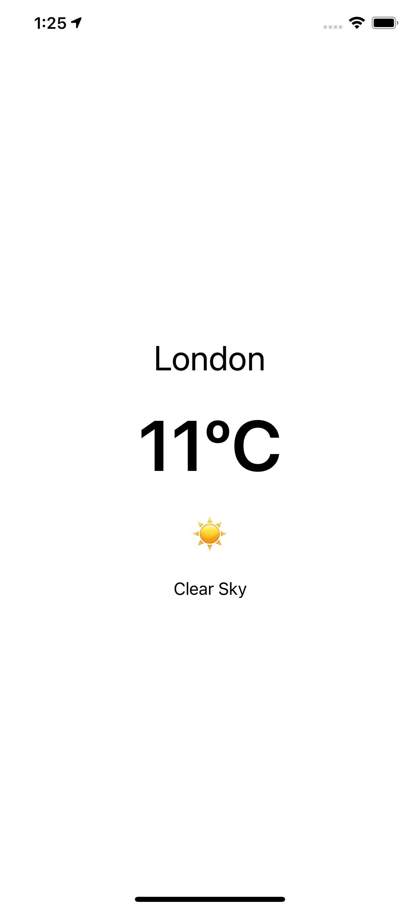
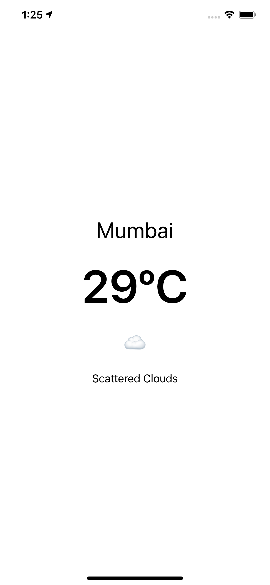
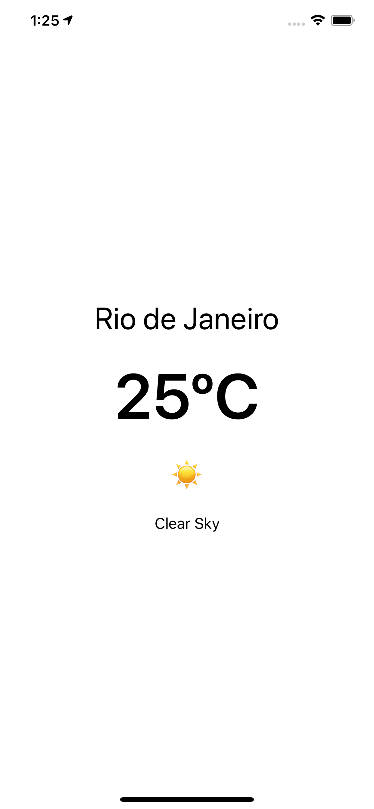

# Weather-App-iOS

Build a simple weather app in Swift using MVVM pattern.

## MVVM

## Screenshots

## Pull Request

Pull Requests are welcome. Please follow these rules for the ease of understanding:
* Make sure to check for available issues before raising one
* Give me a maximum of 24-48 hours to respond
* Have proper documentation on the parts you are changing/adding

## Developed & Maintained by

[👨 Sayan Nath](https://sayannath.biz/)

  
### Show some ❤️ by starring the repository!

